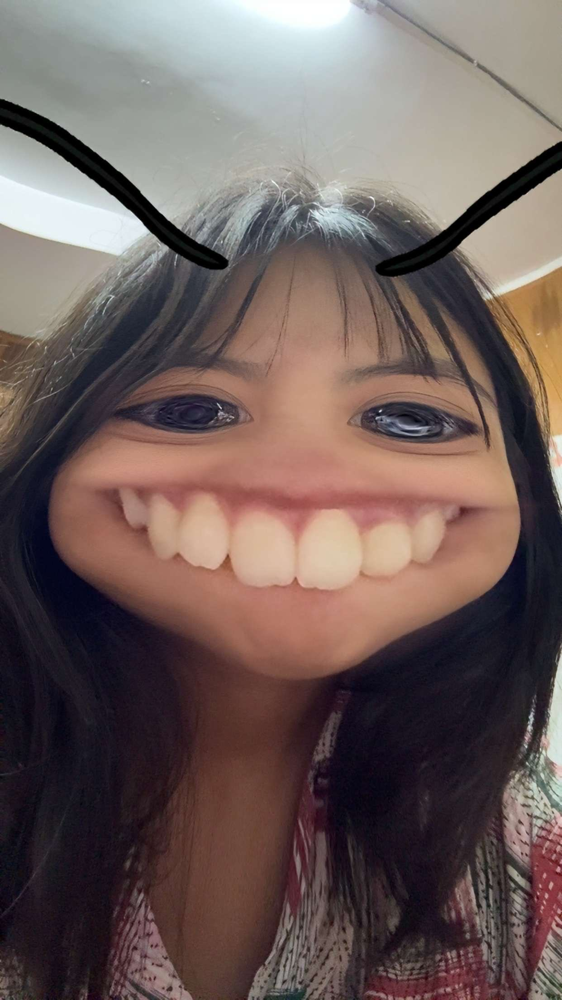

<!DOCTYPE html>
<html lang="en">
<head>
<meta charset="UTF-8">
<meta name="viewport" content="width=device-width, initial-scale=1.0">
<title>For My Love ❤️</title>

</head>
<body>

<h1>sate soe pyay p lrr hin?😣😣😣😣😣</h1>

<button id="yes">Yes 💗</button>
<button id="no">No 😤</button>

<h1>Yay!! Lein mrr lyk tk kaalyy lyyy🙈🙊🤭</h1>

🐻💋

Thank you for understanding ❤️😁

</body>
</html>
